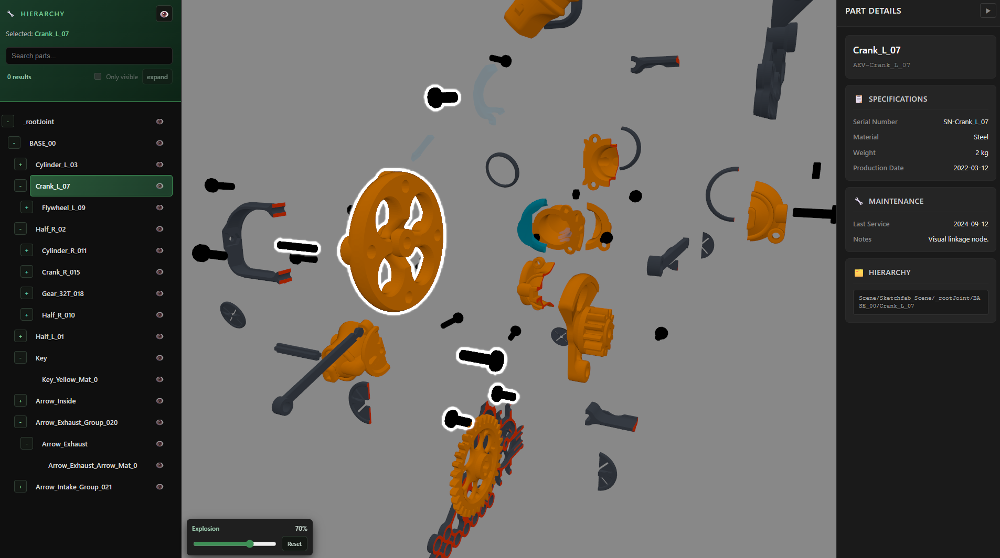
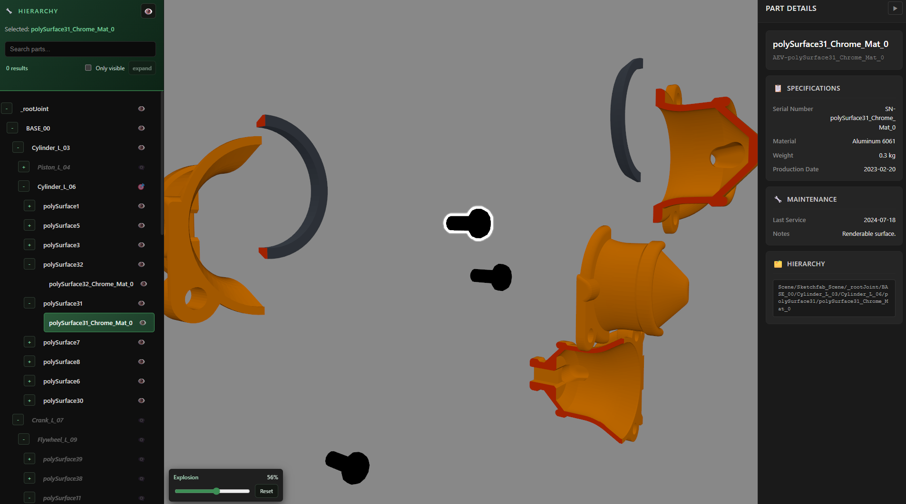

# Interactive Mechanical 3D Demo – React Three Fiber

<p align="center">
  
  
</p>

🌐 Live Demo: 

---

## Overview

This project demonstrates how interactive 3D models can be used to present mechanical systems directly in the browser.

The objective is to showcase how real-time WebGL rendering can enhance:

- Technical product presentations  
- Engineering visualization  
- Interactive exploration of mechanical components  
- Web-based product demonstrations without requiring specialized software  

This demo illustrates how modern web technologies can bridge the gap between engineering data and accessible digital experiences.

While built as a portfolio demo, the structure reflects patterns that can be extended into production-grade industrial viewers.

---

## Key Features

- Interactive 3D: Real-time orbit, zoom, hover and click selection with a synchronized inspector panel.
- Exploded view: Adjustable explosion slider to separate subcomponents for inspection.
- Inspector & metadata: Part-level details and specs pulled from the metadata service and shown side-by-side.
- Hierarchy & filtering: Browse model hierarchy and toggle/ isolate subassemblies for focused views.

---

## Technologies Used

- React  
- Vite  
- Three.js  
- React Three Fiber  
- GLB (Binary glTF format)  

---

## Technical Approach

This project focuses on delivering a clean and efficient real-time 3D experience in the browser.

Key considerations include:

- Structured scene composition  
- Efficient asset loading strategy  
- Responsive camera and interaction setup  
- Clean component organization for scalability  
- Demo built with React Three Fiber to combine familiar web app patterns with high-quality WebGL rendering.
- Responsibilities are separated (rendering, interaction, state) so product decisions and UI experiments can be delivered quickly while keeping the codebase maintainable.

The goal is not only visual presentation but also a maintainable, production-ready architecture.

---

## Technical Appendix

The following section provides additional technical details for developers interested in the architecture and implementation.

- **Architecture:** Rendering is composed around `SceneCanvas` → `InteractiveModel` with feature modules for camera, explosion and selection; application state is centralized in `viewerStateStore`.

- **Data flow:** User actions (pick / hover) update the `viewerStateStore`; UI components such as the `InspectorPanel`, hierarchy list and selection effects react to store changes.

- **Key modules & hooks:** `InteractiveModel.jsx`, `viewerStateStore` (state), `buildExplosionTargets.js`, `explosionMath.js`, `overlapResolution.js`, `useExplosionEffect.js`, `useCameraAnimation.js`, and `useSelectedPartMetadata.js`.

- **Loading & performance notes:** Model loading uses `useGLTF` with `useGLTF.preload` (basic lazy/preload strategy). There is no explicit occlusion culling or spatial indexing beyond Three.js's default frustum culling. Further optimizations (code-splitting/Suspense, BVH, instancing, or progressive/streaming assets) can be added if needed.

- **Implementation notes:** Explosion targets are generated in `buildExplosionTargets.js`; overlap resolution is handled in `overlapResolution.js` to avoid visual collisions between exploded parts. Interaction is implemented with raycasting and visibility flags to pick the topmost visible object.

- **Developer pointers:** The code is organized so that expensive computations (e.g., overlap resolution) can be moved to web workers and features can be swapped with minimal coupling. Look for the explosion domain files under `viewer/three/features/explosion/domain` and the state store under `viewer/features/viewerState/state`.


## Installation

Clone the repository and install dependencies:

```bash
npm install
npm run dev
```

To preview the production build:

```bash
npm run build
npm run preview
```

---

## Credits

3D model [“Oscillating Cylinder Motor for LEGO (3d Print)”](https://skfb.ly/6ZxRG)  
by [Slava Z](https://sketchfab.com/slava).  
Licensed under [Creative Commons Attribution 4.0](http://creativecommons.org/licenses/by/4.0/) 

No endorsement by the author is implied.

The original model was converted from glTF + .bin to a single-file GLB to improve web portability and simplify asset delivery. Conversion embedded textures and resources; no substantive geometry edits were performed.

---

## About

Marcelo Costa  
Frontend & 3D Web Engineer  

Focused on interactive 3D visualization and engineering-oriented web applications.

LinkedIn: [Marcelo Costa](https://www.linkedin.com/in/marcelo-costa-055)
